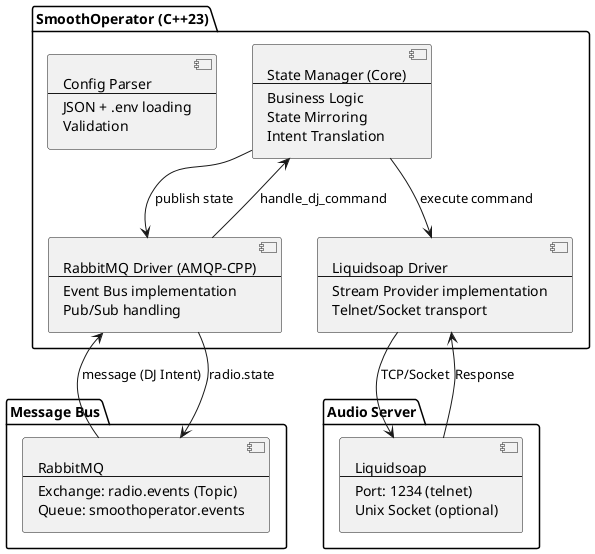

# Architecture

SmoothOperator is a high-performance, single-threaded event-driven daemon written in C++23 that bridges RabbitMQ and Liquidsoap.

## System Overview

## Key Technologies

- **C++23:** Modern language features for safety and performance.
- **Libev:** High-performance event loop for non-blocking I/O.
- **AMQP-CPP:** Robust C++ library for RabbitMQ communication.
- **nlohmann/json:** Modern JSON for C++ used for configuration and message parsing.
- **Clean Architecture:** Decoupling core logic (StateManager) from infrastructure (Drivers).

## Core Design Principles

1. **Single-threaded Event Loop:** Uses `libev` to handle RabbitMQ events and polling timers without the complexity of multi-threading.
2. **State Mirroring:** Proactively polls Liquidsoap and maintains a local "source of truth" to reduce latency for external clients.
3. **Intent Translation:** Maps high-level DJ "intents" (e.g., `dj.skip`) to technical Liquidsoap commands (e.g., `source.skip`).
4. **Dependency Injection:** Drivers are injected into the Core, making it easy to test and swap transports (e.g., switching from Telnet to Unix Sockets).

## Build & Environment

- **CMake:** Standard build system with `GNUInstallDirs` support.
- **Makefile:** Clean wrapper for developers and automated deployments.
- **Sanitizers:** Integrated ASAN, UBSAN, and TSAN for memory and thread safety.

---
**Last Updated:** 2026-04-23
