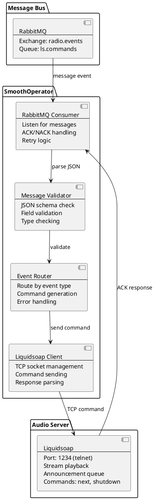
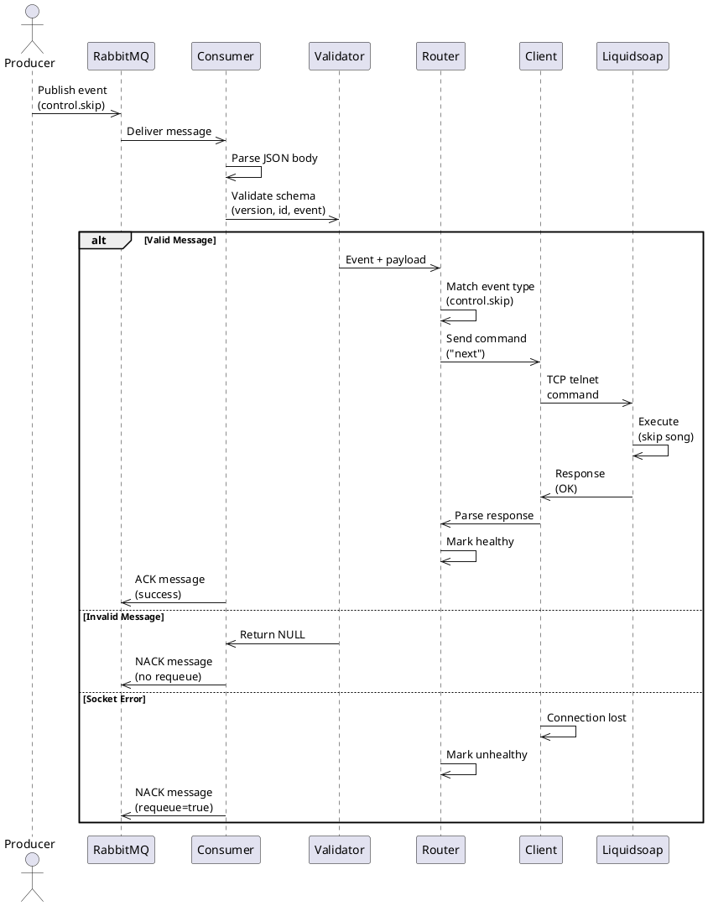
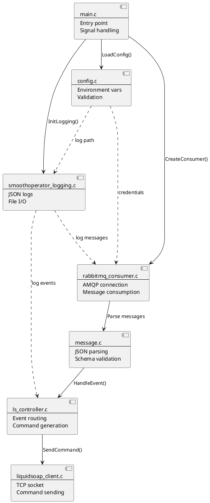
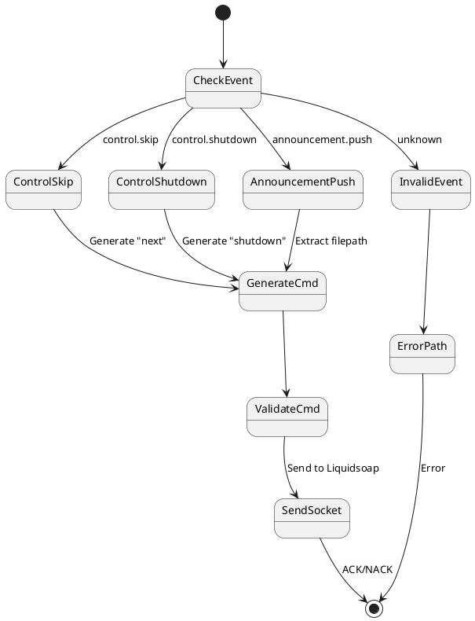
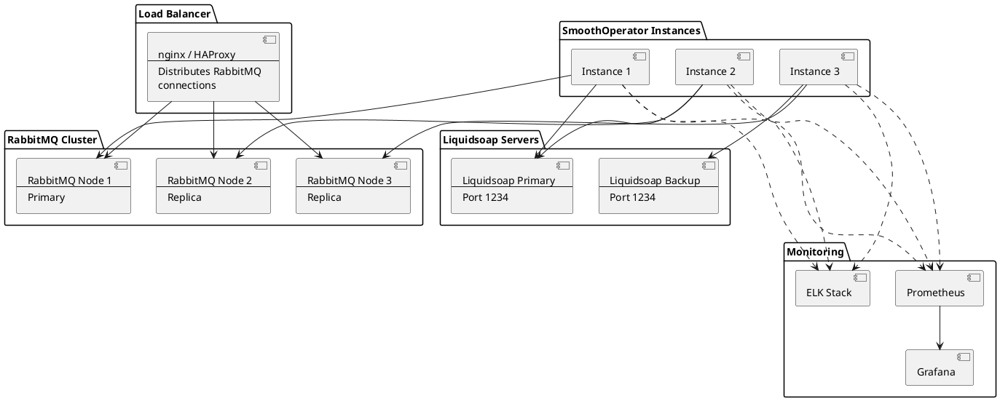
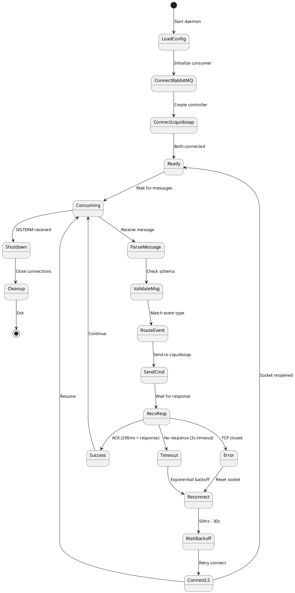

# Architecture

SmoothOperator is a single-threaded event-driven daemon that bridges RabbitMQ and Liquidsoap.

## System Overview



## Message Flow (Sequence Diagram)



## Component Architecture



## Data Structures

### Message Format (JSON)

```json
{
  "version": 1,
  "id": "unique-event-id",
  "timestamp": "2026-04-20T10:30:00Z",
  "event": "control.skip",
  "source": "web-ui",
  "payload": {
    "priority": "high"
  }
}
```

### Message Structure (C)

```c
typedef struct {
  uint32_t version;
  char *id;
  char *timestamp;
  char *event;
  char *source;
  json_t *payload;
} message_t;
```

## Event Routing Table



## Deployment Architecture



## Connection Lifecycle



## Threading Model

**Single-threaded, blocking event loop:**

```
┌─────────────────────────────────────────────────────┐
│                                                     │
│  while (running) {                                  │
│    envelope = amqp_consume_message(...)  ← Blocks  │
│    message = message_parse(envelope)                │
│    result = controller_handle_event(msg)            │
│    amqp_basic_ack() or amqp_basic_nack()           │
│  }                                                  │
│                                                     │
└─────────────────────────────────────────────────────┘

Time blocking:
  - AMQP: Waiting for next message (indefinite)
  - Socket timeout: 3 seconds (configurable)
  - Total latency: <100ms for processed messages
```

## Memory Management

- **calloc()** — Allocate zeroed memory
- **strdup()** — Safe string copying
- **free()** — Explicit cleanup in error paths
- **ASAN/UBSAN** — Runtime detection of errors

**No leaks detected:**
```bash
make debug
ASAN_OPTIONS=verbosity=1 ./build/bin/smoothoperator
```

---

## Key Design Decisions

1. **Single-threaded** — Simpler, no race conditions, easier to reason about
2. **Blocking AMQP** — Let RabbitMQ handle concurrency via QoS prefetch=1
3. **Persistent TCP** — Avoid Liquidsoap connection overhead
4. **JSON validation** — Reject malformed messages early
5. **Exponential backoff** — Handle Liquidsoap restarts gracefully
6. **Structured logging** — Machine-parseable audit trail

---

## Performance Characteristics

| Operation | Time |
|-----------|------|
| Message parse | <1ms |
| Validation | <1ms |
| Routing | <1ms |
| TCP send | <5ms |
| Response wait | 3-50ms |
| **Total** | **<100ms** |

**Throughput:** ~1000 msg/sec (single instance)

For higher throughput, run multiple instances with RabbitMQ load balancing.

---

**Last Updated:** 2026-04-20
