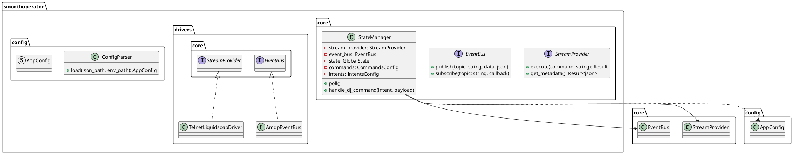

# 🎵 SmoothOperator v1.0.1

> High-performance C++23 RabbitMQ-to-Liquidsoap Gateway following Clean Architecture.

SmoothOperator is the **Global State Gateway** for Intelliurb. It eliminates direct Telnet polling from clients by mirroring Liquidsoap's state in memory and publishing it to RabbitMQ. It also translates DJ "intents" (intelligible JSON) into technical commands.

---

## ✨ Features (v1.0)

- **Clean Architecture:** Core business logic is decoupled from infrastructure (RabbitMQ/Telnet).
- **State Store:** Proactive polling of Liquidsoap with real-time state mirroring.
- **Temporal Enrichment:** Calculates `start_time`, `end_time`, and `duration` for every track.
- **DJ Intent Translation:** Maps `dj.*` RabbitMQ events to precise Liquidsoap actions.
- **Security Hardened:** Verified with **ASAN, LSAN, UBSAN, and TSAN** for memory safety and race-condition prevention.

---

## 🛠️ Requirements

- **Linux:** Ubuntu 22.04+ or Debian 11+
- **Compiler:** GCC 11+ (C++23 support)
- **Libraries:** `libev-dev`, `librabbitmq-dev` (optional if using AMQP-CPP internal), `openssl-dev`.
- **Dependencies (Auto-fetched):** `AMQP-CPP`, `nlohmann/json`, `googletest`.
## 🚀 Installation & Build

```bash
# Install system dependencies
sudo apt-get update && sudo apt-get install -y cmake g++ libev-dev libssl-dev pkg-config

# Clone and Build using the simplified Makefile
git clone https://github.com/intelliurb-lab/smoothoperator.git
cd smoothoperator
make release
```

### Advanced Build Options:
You can customize the installation and build process using variables:

```bash
# Change installation prefix (default is /usr/local)
make install BASE_DIR=/opt/radio

# Specify a different source directory
make release SOURCE_DIR=/path/to/source

# Install as a systemd service
sudo make install-systemd BASE_DIR=/opt/radio
```

## 🎮 Usage

```bash
./smoothoperator [options]
```

### Options:
- `-h, --help`: Show help message, author, and license information.
- `-c, --config, --conf <path>`: Specify the path to the JSON configuration file (default: `smoothoperator.json`).

---

## ⚙️ Configuration
### Running Tests (Safety Verification)

We use extensive sanitizers to ensure production stability:

```bash
# Build with AddressSanitizer and UndefinedBehaviorSanitizer
cmake .. -DENABLE_ASAN=ON
make && ./smoothoperator_unit_tests
```
---

## ⚙️ Configuration

SmoothOperator uses a dual-config system to separate infrastructure from secrets.

### 1. `smoothoperator.json` (Infrastructure)
Create this file in the root directory. It maps technical commands and message routing.

| Section | Field | Description |
|---------|-------|-------------|
| **rabbitmq** | `host`/`port` | Connection details for the RabbitMQ broker. |
| | `user` | Username (Password is stored in `.env`). |
| | `binding_key` | Routing pattern SmoothOperator listens to (e.g., `dj.#`). |
| | `state_routing_key` | Topic where SmoothOperator publishes the global state. |
| **liquidsoap**| `polling_interval_ms`| How often SmoothOperator asks Liquidsoap for updates. |
| **commands** | (various) | Customizes the technical strings sent to Liquidsoap telnet/socket. |
| **intents** | (various) | Maps RabbitMQ routing keys to internal business logic actions. |

### 2. `.env` (Secrets)
Create a `.env` file (strictly ignored by git):

```bash
RABBITMQ_PASS=your_secure_password_min_16_chars
GEMINI_API_KEY=your_optional_key
```

---

## 🏗️ Appendix: System Architecture

### Class Diagram (PlantUML)



---

<div align="center">
  <b>SmoothOperator v1.0.1 - Carlos A. Quintella / Intelliurb</b>
</div>
SmoothOperator expects a **Topic Exchange** named `radio.events`.

1. **Declare Exchange:** `radio.events` (Type: `topic`).
2. **Declare Queue:** `smoothoperator.events`.
3. **Bind Queue:** Bind `smoothoperator.events` to `radio.events` with routing key `dj.#`.
4. **State Feedback:** Bind your frontend/clients to `radio.state` to receive state updates.

---

## 🎮 Usage Examples (Python)

### Sending DJ Commands (Intents)

```python
import pika, json

def send_command(intent, payload):
    connection = pika.BlockingConnection(pika.ConnectionParameters('127.0.0.1'))
    channel = connection.channel()
    
    channel.basic_publish(
        exchange='radio.events',
        routing_key=intent,
        body=json.dumps(payload)
    )
    connection.close()

# Example: Skip current track
send_command("dj.skip", {})

# Example: Set new playlist
send_command("dj.set_playlist", {"uri": "/music/jazz_night.m3u"})
```

### Listening to Global State Updates

```python
import pika, json

def on_state_update(ch, method, properties, body):
    state = json.loads(body)
    print(f"🎵 Now Playing: {state['track']['title']} by {state['track']['artist']}")
    print(f"🕒 Ends at: {state['track']['end_time']}")

connection = pika.BlockingConnection(pika.ConnectionParameters('127.0.0.1'))
channel = connection.channel()

queue = channel.queue_declare(queue='', exclusive=True).method.queue
channel.queue_bind(exchange='radio.events', queue=queue, routing_key='radio.state')

channel.basic_consume(queue=queue, on_message_callback=on_state_update, auto_ack=True)
print("📡 Waiting for state updates...")
channel.start_consuming()
```

---

## 🛡️ Security & Stability

This project is rigorously tested against:
- **ASAN/LSAN:** Detects memory leaks and buffer overflows.
- **UBSAN:** Detects undefined behavior (integer overflows, null pointer dereferences).
- **TSAN:** Detects data races in multi-threaded contexts.
- **Stress Testing:** Validated against 1000+ concurrent messages via `test/stress_test.py`.

---

<div align="center">
  <b>SmoothOperator v1.0.1 - Intelliurb</b>
</div>
